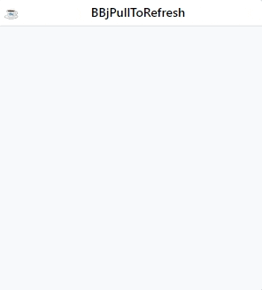
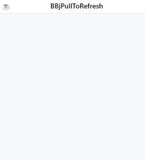

# BBjPullToRefresh Widget

<p>
  <a href="http://www.basis.cloud/downloads">
    
  </a>
  <a href="https://github.com/BBj-Plugins/BBjPullToRefresh/blob/master/README.md">
    
  </a>
  <a href="https://github.com/necolas/issue-guidelines/blob/master/CONTRIBUTING.md#pull-requests">
    
  </a>
   <a href="https://basishub.github.io/basis-next/#/dwc/bbj-refresher">
    
  </a>
</p>

BBjPullToRefresh lets a user pull down on a child window using touch in order to refresh or retrieve more data.

Pull-to-refresh is widely used on devices with a touch screen. You can use the APIs shown here to implement pull-to-refresh in your DWC app.

## Features

- Easy to set up
- Easy to customize
- Works on any BBjChildWindow

And much more !

## Installation

- Clone the [project](https://github.com/BBj-Plugins/BBjPullToRefresh) locally , then add `BBjPullToRefresh` to your BBj paths
- Or [Use the plugins manager](https://www.bbj-plugins.com/en/get-started)

## The gist

```BBj
USE ::BBjPullToRefresh/BBjPullToRefresh.bbj::BBjPullToRefresh
USE ::BBjPullToRefresh/BBjPullToRefresh.bbj::BBjPullToRefreshEvent

wnd! = BBjAPI().openSysGui("X0").addWindow(10,10,300,300,"BBjPullToRefresh",$$)
wnd!.setCallback(BBjAPI.ON_CLOSE,"eoj")
container! = wnd!.addChildWindow(wnd!.getAvailableControlID(), 0, 0, 300, 300, "", $0000800$, BBjAPI().getSysGui().getAvailableContext())

ptr! = new BBjPullToRefresh(container!)
ptr!.onRefresh("onRefresh")

PROCESS_EVENTS

onRefresh:

    declare AUTO BBjPullToRefreshEvent payload!

    ev! = BBjAPI().getLastEvent()
    payload! = ev!.getObject()
    control! = payload!.getControl()
    WAIT 3
    control!.finish()
RETURN

eoj:
RELEASE

```

<br><br>
<div style="text-align: center;">
  
</div>
<br><br>

## Themes

Like other BBj Controls, The BBjPullToRefresh supports themes. You can set the theme using the `BBjPullToRefresh:setTheme` method.

Supported themes are :

- BBjToast.THEME_PRIMARY
- BBjToast.THEME_SUCCESS
- BBjToast.THEME_WARNING
- BBjToast.THEME_DANGER
- BBjToast.THEME_INFO
- BBjToast.THEME_GRAY

You can also create a custom theme by assigning the widget a custom attribute

```BBj
USE ::BBjPullToRefresh/BBjPullToRefresh.bbj::BBjPullToRefresh

style! = "
: [theme=""my-custom-theme""]{
:   color: teal;
: }
:"

web! = BBjAPI().getWebManager()
web!.injectStyle(style!, 0)

wnd! = BBjAPI().openSysGui("X0").addWindow(10,10,300,300,"BBjPullToRefresh",$$)
wnd!.setCallback(BBjAPI.ON_CLOSE,"eoj")

container! = wnd!.addChildWindow(wnd!.getAvailableControlID(), 0, 0, 300, 300, "", $0000800$, BBjAPI().getSysGui().getAvailableContext())

ptr! = new BBjPullToRefresh(container!)
ptr!.setAttribute("theme","my-custom-theme")
ptr!.onRefresh("onRefresh")

PROCESS_EVENTS

onRefresh:
  WAIT 3
  ptr!.finish()
RETURN

eoj:
RELEASE
```

## Texts

BBjPullToRefresh goes throw three stages:

- **Pull**: When the child window is being pulled
- **Release**: When the child window reached the pull's threshold
- **Refresh**: When the child window is being refreshed

For each of the previous stages , BBjPullToRefresh provides a method to set
the instruction text of the stage.

```BBj
ptr! = new BBjPullToRefresh(container!)

ptr!.setTextPull("pulling ...")
ptr!.setTextRelease("You can release now")
ptr!.setTextRefresh("Awesome work in progress")
```

## Icons

BBjPullToRefresh allows to replace the default arrow icon and the refresh icon by using the methods:

- BBjPullToRefresh.setIconArrow
- BBjPullToRefresh.setIconRefresh

Icons are strings which can be in any of the following formats:

- **Url**: (ex: /path/to/image.gif)
- **Data Url**: (ex: data:image/jpeg;base64,/9j/4SDpRXhpZgAAT....)
- **icon**: An icon to load from the default BBj icons pool. (ex: `chevron-down`)
- **pool:icon**: An icon to load from the passed pool. (ex: `feather:arrow`)

```BBj
USE ::BBjPullToRefresh/BBjPullToRefresh.bbj::BBjPullToRefresh

wnd! = BBjAPI().openSysGui("X0").addWindow(10,10,300,300,"BBjPullToRefresh",$$)
wnd!.setCallback(BBjAPI.ON_CLOSE,"eoj")

container! = wnd!.addChildWindow(wnd!.getAvailableControlID(), 0, 0, 300, 300, "", $0000800$, BBjAPI().getSysGui().getAvailableContext())

ptr! = new BBjPullToRefresh(container!)
ptr!.setIconRefresh("https://cdnjs.cloudflare.com/ajax/libs/timelinejs/2.25/css/loading.gif")
ptr!.onRefresh("onRefresh")

PROCESS_EVENTS

onRefresh:
  WAIT 3
  ptr!.finish()
RETURN

eoj:
RELEASE
```

<br><br>

<div style="text-align: center;">
  
</div>
<br><br>

## Threshold

The minimum distance of the pull until the refresher will go into the release state `(Threshold)` and The maximum distance of the pull `(ThresholdMax)` can be configured using the methods:

- BBjPullToRefresh.setThreshold
- BBjPullToRefresh.setThresholdMax

## Events

BBjPullToRefresh exposes only one event `onRefresh`. You can listen to the `onRefresh` event by setting a callback using the `BBjPullToRefresh:onRefresh` method. The event's payload is an instance of `BBjPullToRefreshEvent`
